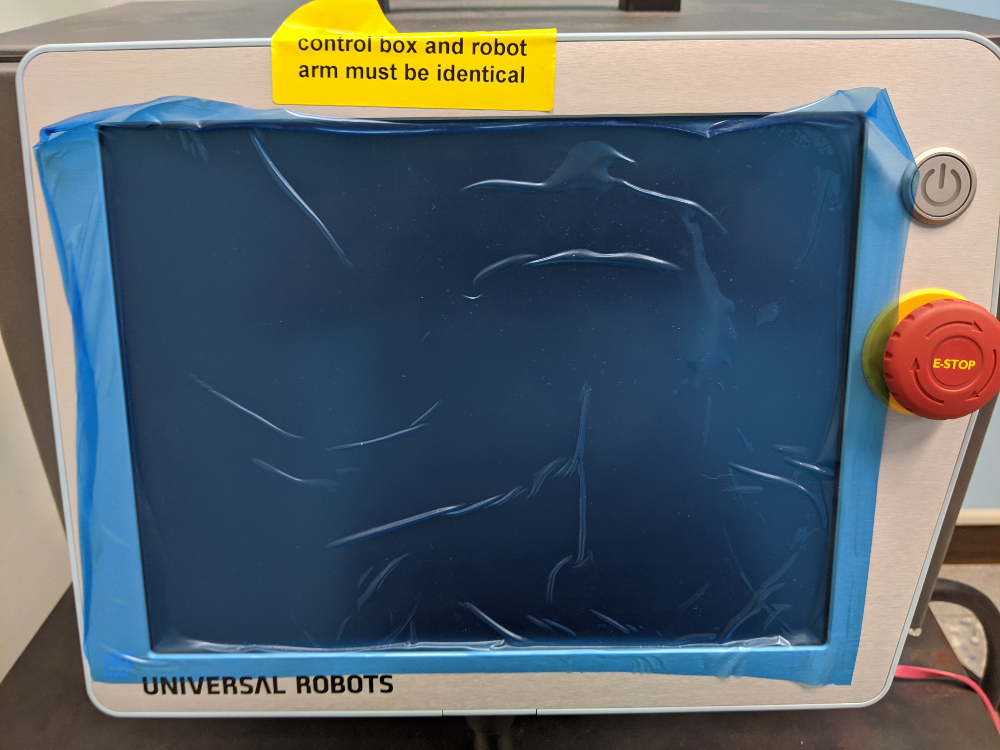
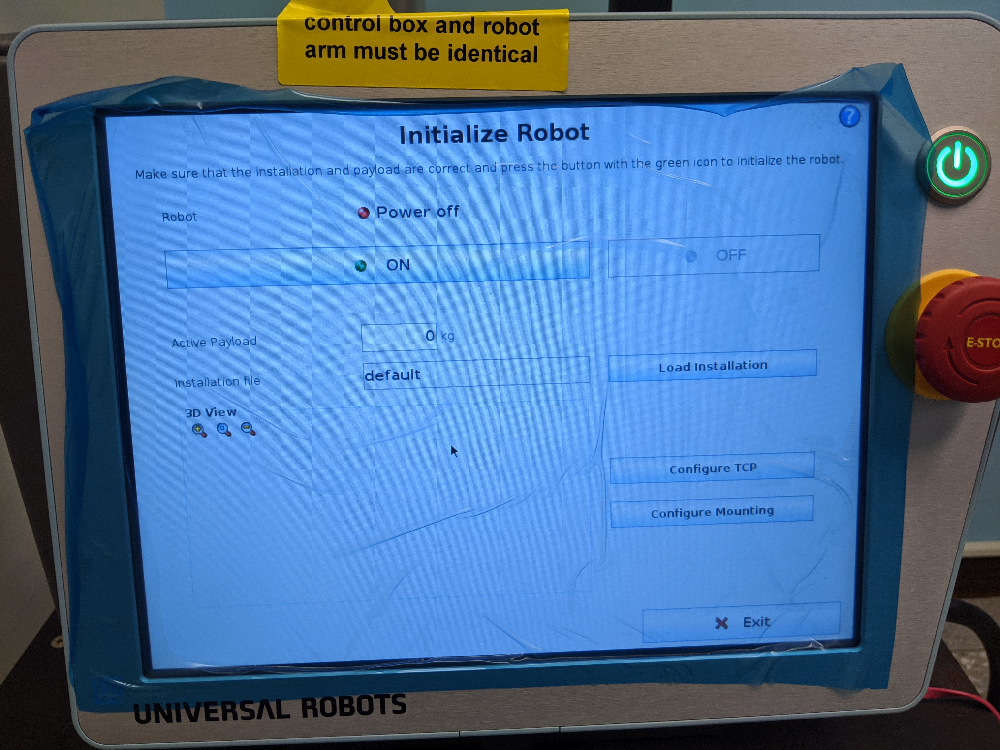
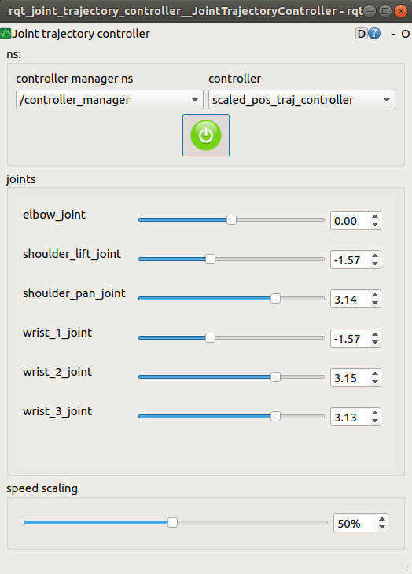
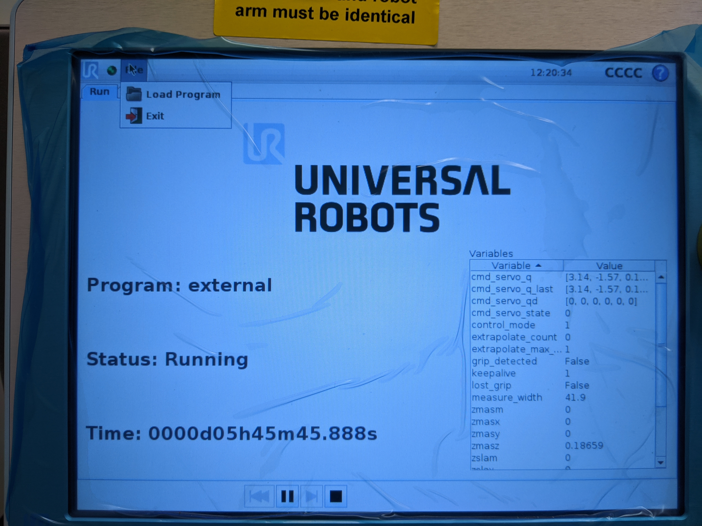

# UR5 manual for ElsaLab

# Table of content
* [Using ASUS X441S (white little laptop)](#Using-ASUS-X441S)
    * [Open ROS Driver](#Open-ROS-Driver)
    * [Open GUI](#Open-GUI)
    * [Before turn off UR5](#Before-turn-off-UR5)
* [Build up ROS Driver on Your Own Computer](#Build-up-ROS-Driver-on-Your-Own-Computer)
    * [Laptop Requirements](#Laptop-Requirements)
    * [UR5 Information](#UR5-Information)
    * [How to build up ROS Driver](#How-to-build-up-ROS-Driver)

# Using-ASUS-X441S

(Should be at 637)

UR5 Driver has been intalled.
Here are the steps to control ur5 robot arm.
## Open ROS Driver
1. Turn on UR5. It could take 2-3 minutes.

2. Follow the several steps as the images below




Here you are, stay in this sceen.
3. Go to the laptop. Connect the Ethernet to UR5 (the red wire), and select wired conection *UR5*
4. Go to terminal<br> `$ roslaunch ur_robot_driver ur5_bringup.launch robot_ip:=192.168.56.101
`
5. Start UR5 program as the images show below


## Open GUI
6. Start another terminal<br> `$ rosrun rqt_joint_trajectory_controller rqt_joint_tractory_controller
`
7. Now you control UR5 with GUI


## Before turn off UR5
It's important to reset joints' positions before turning off UR5. Here's the prosedure:



Press the button Auto and **HOLD ON** utill robot arm moves into position.

# Build up ROS Driver on Your Own Computer
## Laptop Requirements
OS can be either:
* Ubuntu 16.04 + Kinetic
* Ubuntu 18.04 + Melodic

Ubuntu 16.04
```
$ uname -a
Linux elsalab-GP62MVR-7RF 4.15.0-99-generic #100~16.04.1-Ubuntu SMP Wed Apr 22 23:56:30 UTC 2020 x86_64 x86_64 x86_64 GNU/Linux
```

Ubuntu 18.04
```
$ uname -a
Linux elsalab-X441SA 5.3.0-51-generic #44~18.04.2-Ubuntu SMP Thu Apr 23 14:27:18 UTC 2020 x86_64 x86_64 x86_64 GNU/Linux
```

## UR5 Information
* Hardware Model
    * UR5(CB31UR5) (CB3) (CB Series)
* Software Version
    * 3.10.0

## How to build up ROS Driver
[Head to UR5 github page](https://github.com/UniversalRobots/Universal_Robots_ROS_Driver)
